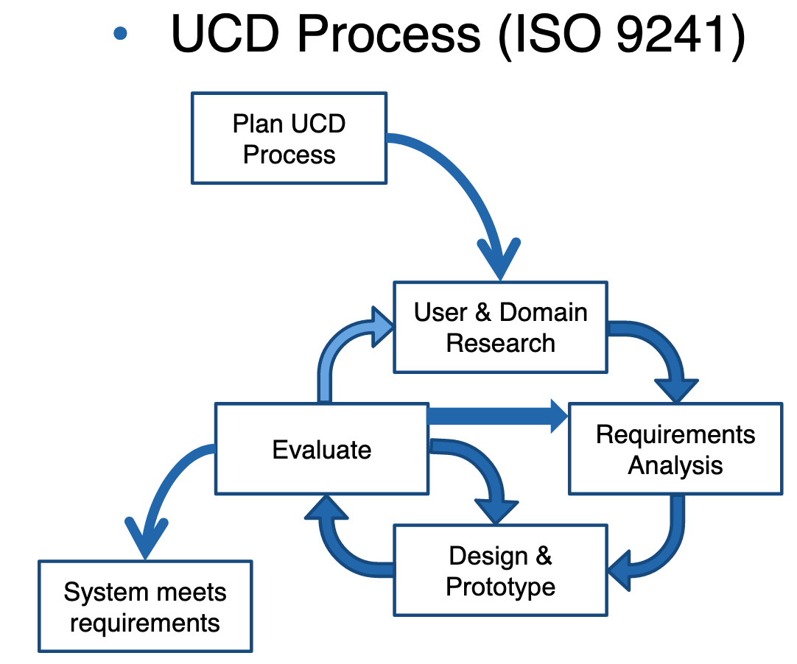
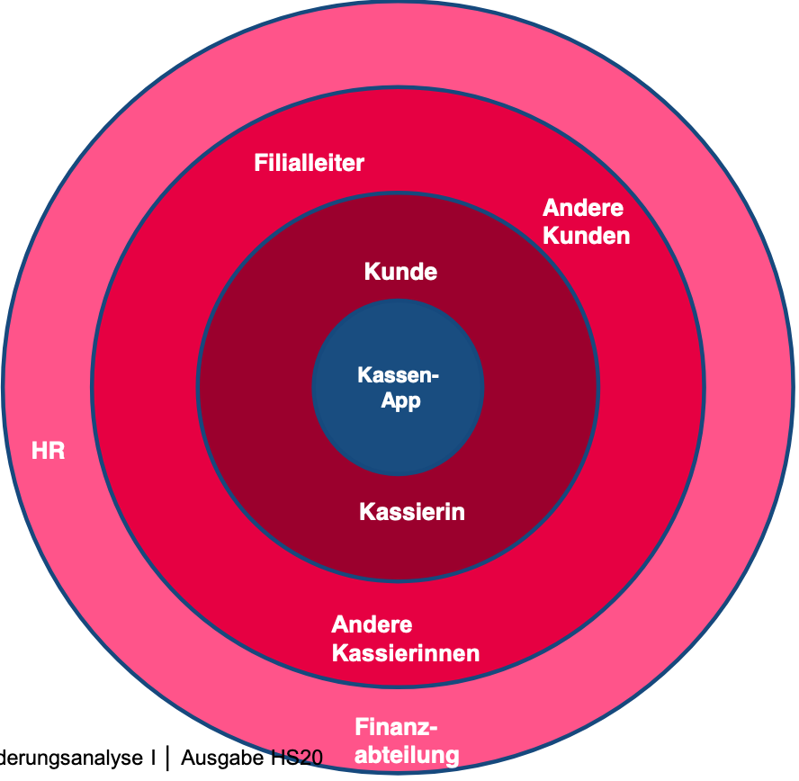

= SWEN Zusammenfassung
Joël Plambeck <plambjoe@students.zhaw.ch>
0.1,
:toc:
:sectnums:
:sectnumlevels: 3 % sets numbering of header up to level 5
:icons: font

== Software Engineering

Software Engineering beschäftigt sich mit der Herstellung oder Entwicklung von Software, der Organisation und Modellierung der zugehörigen Datenstrukturen und dem Betrieb von Softwaresystemen

|===

| Kernprozesse | Unterstützungsprozesse
a| 
* Anforderungsanalyse (engl. requirementsengineering)
* Softwarearchitektur und Design (engl. softwarearchitectureand design)
* Implementierung (engl. softwareconstruction)
* Softwaretest (engl. softwaretesting)
* Softwareverteilung (engl. softwaredeployment)
* Softwareeinführung (engl. softwarerollout)
* Wartung/Pflege (engl. softwaremaintenance)

a| 
* Projektmanagement (engl. projectmanagement)
* Konfigurationsmanagement (engl. configurationmanagement)
* Qualitätsmanagement (engl. qualitymanagment)
* Risikomanagement (engl. riskmanagement)

|===

=== Iterativ-inkrementell Entwicklungsprozess 

image::http://upload.wikimedia.org/wikipedia/commons/a/ac/Iterative_development_model_V2.jpg[Iteratives Modell, 300, float="right"]

Software wird in mehreren geplanten und kontrolliert durchgeführten Iterationsschritten stückweise (inkrementell) entwickelt.

Ziel und Gelände sind am Anfang unklar: Lenkwaffe.

|===
| Vorteile | Nachteile

a|
* Flexibles Modell bei unklaren Anforderungen/Zielen.
* Gutes Risikomanagement (Mitarbeiter und Technologie).
* Frühe Einsetzbarkeit der Software und Feedback

a| 
* Detaillierte «upfront» Planbarkeit hat Grenzen (Funktionalität, Zeit und Kosten).
* Braucht eine Involvierung und Steuerung durch den Kunden über die ganze Projektdauer

|===

[horizontal]
Definierte Prozesskontrolle:: für einfache und völlig planbare Problemstellungen
Empirische Prozesskontrolle (Agil):: für komplexe, chaotische Problemstellungen (unbekannt, stetig ändernd)

=== Modelle 

Modelle helfen ein Gebilde zu verstehen und kommunizieren. Es hilft as Gebilde zu gestalten, bewerten und kritisieren

=== UML

[horizontal]
Sketch:: informelle und unvollständige Diagramme (von Hand)
Blueprint:: detaillierte Analyse- und Design-Diagramme für Code
Programming-Laguage:: Komplete, ausführbare Spezifikationeines Software-Systems in UML

== Anforderungsanalyse

* Usability
** Deutsch: Gebrauchstauglichkeit
* User Experience
** = Usability + Desirability
* Customer Experience
** = Usability + Desirability + Brand experience

=== Usability Engineering
Ziel: Software entwickeln, welche 3 Anforderungen erfüllt
|===
|Effektivität |Effizienz |Zufriedenheit

|Alle Aufgaben können vollständig erfüllt werden

|Die Aufgabe kann mit angemessenem Aufwand erledigen werden (Mental, Physisch, Zeit)

|Mit dem System/Interaktion ist der Benutzer erfreut

|===
=== Usability Anforderungen
Anforderungsbereiche bezüglich Usabilty

* Aufgabenangemessenheit
* Lernförderlichkeit
* Individualisierbarkeit
* Erwartungskonformität
* Selbstbeschreibungsfähigkeit
* Steuerbarkeit
* Fehlertoleranz

=== User-Centered Design (UCD)

.User-Centered Design

==== User & Domain Research

*Wer* sind die User? *Was* sind ihre Ziele/Kontext? *Wie*? 

[horizontal]
Contextual Inquiry:: Experte beobachtet User bei seinem Job
Contextual Interview:: 
* Strukturiert (Mündlicher Fragebogen)
* Semi-strukturiert
* Unstrukturiert (Keine Vorbereitung, nur grobe Ziele)

'''
User-Centered Design Process Artefakte:

.Stakeholder Map

[horizontal]
Personas:: Fiktive Person, represäntiert bestimmte Benutzergruppe
Usage-Szenarien:: Beschreiben die *aktuelle Situation*
Kontext-Szenarien:: Beschreiben die *zukünftige Situation*
Blueprint:: Geschäftsprozessmodell
Storyboard:: Comic mit Schlüsselszenen, 6-8 Bilder mit 1-2 Sätzen
Interaktionskonzepte:: Beschreibt die Interkation mit dem Benutzer
Wireframes:: UI-Prototypen des Interaktionskonzept

.User & Domain Research
image::img/UDR.png[User & Domain Research Diagram, 300, float="right"]

Fokusgruppen, Umfragen, Nutzungsauswertung, Desktop Research

==== Requrements Analysis

* Wann, wie und warum interagiert der Benutzer mit dem System
* Was sind die wichtigsten Anforderungen an die Interaktion und das System an Benutzersicht

==== Design & Prototype

* Entwicklung des Interaktionskonzepts 
* Umsetzung des Konzepts mit Interaktionsprototypen

==== Evaluate

* Test des Interaktionskonzepts mit Benutzern & Fachexperten
* Basierend auf den Interaktionsprototypen

=== Geschäftsprozessmodell

=== Funktionale Anforderungen (mit Use-Cases)

=== Use Cases

=== Systemsequenzdiagram (SSD)

Formal ein UML Sequenzdiagram
Interaktionen der Akteure mit dem System

